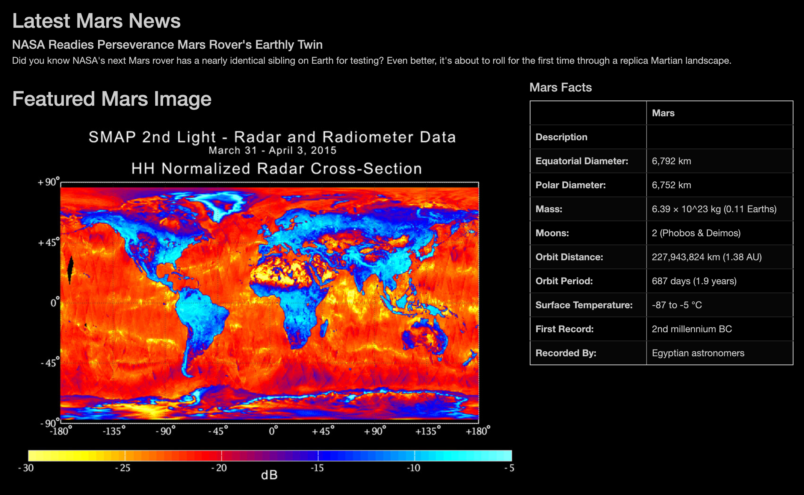

# NASA Mars Webscraping

 

### Background
Created a app.py web scrapper (needs to run app.py to load flask and scrapper). The index.html includes a dashboard on Mar's basic metrics/facts, the latest news on mars, high-res images of mars, and the lastest and most featured image of mars. All of this is scrapped from Mar's website. This process uses BeautifulSoup, Splinter to scrape NASA's website, stores the information in MongoDB, and then uses Flask, javascript, Bootstrap to display the data. 

### Objectives
* Use BeautifulSoup and Splinter to automate a web browser and scrape high-resolution images.
* Use a MongoDB database to store data from the web scrape.
* Update the web application and Flask to display the data from the web scrape.
* Use Bootstrap to style the web app.

### Procedure
* Visited the Mars Hemispheres web site to view the hemisphere images and use DevTools to find the proper elements to scrape.
* Obtained high-resolution images for each of Mars's hemispheres.
* Saved both the image URL string (for the full-resolution image) and the hemisphere title (with the name).
* Used a Python dictionary to store the data using the keys 'img_url' and 'title'.
* Appended the dictionary with the image URL string and the hemisphere title to a list. This list will contain one dictionary for each hemisphere.

### Tech Used:
* Python
* Jupyter Notebook
* HTML
* CSS
* Bootstrap
* BeautifulSoup
* Splinter
* Flask
* MongoDB

